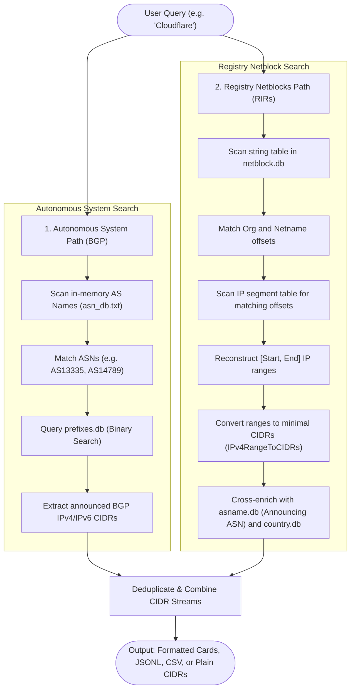

# Data Sources and Correlation Architecture

This document provides a comprehensive reference on where `asname` obtains its data, the formats and protocols used, and how it correlates disparate routing and registry data sources to discover all IP addresses belonging to any organization.

---

## 1. Overview & Architectural Philosophy

`asname` operates on an **offline-first, zero-dependency** model. Rather than querying third-party web APIs at runtime, it downloads the authoritative raw data artifacts of the global internet, compiles them into optimized, local binary search structures (LC-tries, index tables, and flattened segment arrays) stored in `~/.asname/`, and answers queries in microseconds without network latency or external rate limits.

### The Fundamental Duality: Routing vs. Ownership

Internet address intelligence fundamentally splits into two separate domains:

1. **BGP Routing State (Who *transits* traffic)**:
   Global BGP routing tables announce which Autonomous System Number (ASN) originates an IP prefix. However, BGP routing reflects operational topology, not legal ownership. When an enterprise leases an IP range inside a hosting provider, cloud provider, or datacentre (e.g., Equinix, AWS), BGP only shows the provider's ASN.
2. **RIR Allocations & Assignments (Who *owns* or *leases* the space)**:
   Regional Internet Registries (RIRs) record legal allocations and downstream customer assignments in their WHOIS databases. These records identify the end organization, but provide no information on whether or how those addresses are currently routed on the internet.

`asname` correlates both layers to provide a unified view of internet assets.

---

## 2. Data Sources & Ingestion Inventory

`asname` aggregates data across RIRs, route collectors, and cloud providers:

| Data Category | Target Local File | Upstream Sources & Endpoints | Format / Protocol | Ingestion & Build Process |
| :--- | :--- | :--- | :--- | :--- |
| **BGP Routing Table** | `asname.db` `prefixes.db` | Tried in order: 1. **RouteViews**: `http://archive.routeviews.org/bgpdata/%s/RIBS/` *(with `route-views6` for IPv6)* 2. **RIPE RIS rrc04**: `https://data.ris.ripe.net/rrc04/%s/` 3. **RIPE RIS rrc00**: `https://data.ris.ripe.net/rrc00/%s/` | MRT format (`TABLE_DUMP_V2`), compressed via `bzip2` or `gzip` | • Downloads the latest monthly dump. • Builds `asname.db` as an LC-trie mapping IP $\to$ ASN. • Builds `prefixes.db` mapping ASN $\to$ announced IPv4/IPv6 CIDRs. |
| **Autonomous System Names** | `asn_db.txt` | **RIPE NCC**: `https://ftp.ripe.net/ripe/asnames/asn.txt` | Plain text, whitespace-delimited (`<asn> <name>, <country>`) | Downloads and normalizes entries into a fast indexed lookup table of ASN $\to$ Organization Name and Country. |
| **Country Delegations** | `country.db` | **All 5 RIR Delegation Statistics**: • [ARIN](https://ftp.arin.net/pub/stats/arin/delegated-arin-extended-latest) • [RIPE NCC](https://ftp.ripe.net/pub/stats/ripencc/delegated-ripencc-latest) • [APNIC](https://ftp.apnic.net/apnic/stats/apnic/delegated-apnic-latest) • [LACNIC](https://ftp.lacnic.net/pub/stats/lacnic/delegated-lacnic-latest) • [AFRINIC](https://ftp.afrinic.net/pub/stats/afrinic/delegated-afrinic-latest) | RIR Statistics Exchange Format (`\|`-delimited text) | Streams every registry file, extracts `allocated` and `assigned` IPv4 and IPv6 blocks, maps them to ISO 3166-1 alpha-2 codes, and builds an LC-trie. |
| **Registry Netblocks & Organizations** | `netblock.db` | • **APNIC**: `https://ftp.apnic.net/apnic/whois/` • **RIPE NCC**: `https://ftp.ripe.net/ripe/dbase/split/` • **AFRINIC**: `https://ftp.afrinic.net/dbase/afrinic.db.gz` • **ARIN**: Bulk Whois API if `ASNAME_ARIN_APIKEY` is set; otherwise ARIN's extended delegation statistics | RPSL Whois dumps (`inetnum`, `inet6num`, `organisation`, `descr`) and ARIN XML/REST Bulk Whois | Merges all RIR ranges into a unified string table and flattens overlapping intervals into disjoint segments so suballocations take precedence. |
| **City Geolocation** *(Optional)* | `city.mmdb` | **DB-IP Lite City Database**: `https://download.db-ip.com/free/dbip-city-lite-%s.mmdb.gz` | MaxMind DB binary format (`.mmdb`) | Downloaded and decompressed directly for city, region, and coordinate resolution. |
| **Network Categories** *(Optional)* | `category.db` | • Cloud IP lists: AWS, GCP, Oracle, Fastly, Cloudflare, DigitalOcean, Linode, Vultr • Tor Project Bulk Exit List • PeeringDB API (`/api/net`) • bgp.tools operator tags | JSON, CSV, and plain-text CIDR feeds | Indexes exact cloud/CDN/Tor ranges alongside ASN-level operator tags into a dual prefix/ASN classification database. |
| **Online Fallbacks** | *In-memory* | • **RIPEstat API**: `https://stat.ripe.net/data/announced-prefixes/data.json?resource=AS%d` • **Live WHOIS**: TCP port 43 starting at `whois.iana.org` | JSON over HTTPS / TCP port 43 | Queried on demand (with user consent) when offline databases lack specific prefixes or netblocks. |

---

## 3. Specialized Ingestion Heuristics

### The ARIN "Bridge" Heuristic (No API Key Required)

ARIN restricts its full Bulk Whois database behind a signed legal agreement and an API key that forbids redistribution. However, ARIN publicly publishes daily **extended delegation statistics**. 

The challenge: ARIN delegation statistics contain **no organization names**—each record contains only an opaque organization ID (e.g. `ORG-XYZ1-ARIN`).

`asname` resolves this via cross-source synthesis ([`internal/sources/arindelegated.go`](file:///home/mj12/code/asname/internal/sources/arindelegated.go)):
1. In the delegation file, ARIN assigns both IP address blocks and Autonomous System Numbers to that same opaque organization ID.
2. `asname` joins the organization ID to all ASNs assigned to it.
3. It maps each ASN to an organization name using RIPE NCC's public `asn.txt`.
4. It resolves naming variations across multiple ASNs using a majority vote, breaking ties with the lowest ASN number.
5. It applies the resolved name to the IP netblocks assigned under that ID.

This recovers organization names for **~72% of ARIN's IPv4 ranges (87% of addresses)** and **~89% of its IPv6 ranges** completely open and license-free.

### Interval Flattening

Registry netblock data contains overlapping allocations and assignments (e.g., an RIR allocates a `/16` to a datacentre, which assigns a `/24` to an ISP, which assigns a `/28` to a corporate customer).

`asname` resolves this using an interval stack algorithm ([`Flatten` in `internal/sources/netblockdata.go`](file:///home/mj12/code/asname/internal/sources/netblockdata.go)):
- Ranges are sorted by start address ascending, then by size descending.
- A stack tracks active parent allocations.
- Overlapping segments are sliced into flat, non-overlapping boundary intervals where the most specific (innermost) assignment always wins.
- The resulting segments are written to disk for binary search.

---

## 4. How `asname` Combines Sources on an Org Search

When executing `asname search "<Query>"` or `asname search --ips-only "<Query>"`, `asname` executes a **two-pronged search pipeline** across both BGP routing tables and registry allocations:

### Path 1: Autonomous System Search (`SearchASNs`)
1. **Name Matching**: `asname` searches its in-memory AS name table (`asn_db.txt`, parsed from RIPE NCC). It strips trailing country suffixes (so a query like `"us"` does not match every American AS) and performs a case-insensitive substring match.
2. **Prefix Extraction**: For every matching ASN, `asname` looks up the ASN in `prefixes.db` via binary search over the fixed index table. This retrieves all IPv4 and IPv6 CIDRs announced by that ASN in global BGP routing.

### Path 2: Registry Netblock Search (`SearchNetblocks`)
Organizations often do not have their own ASN; instead, they receive direct assignments or suballocations routed under their provider's ASN.
1. **String Table Scan**: `asname` scans the string pool in `netblock.db` to identify all byte offsets where the organization name or `netname` matches the query.
2. **Segment Scanning**: It sweeps the binary segment tables and extracts every IP segment tagged with a matching string offset.
3. **CIDR Decomposition**: Registry records represent arbitrary IP spans (e.g., `192.0.2.16 - 192.0.2.31`). `asname` decomposes arbitrary spans into minimal sets of standard power-of-two CIDR blocks using bitwise trailing zeros and prefix length calculations ([`IPv4RangeToCIDRs` and `IPv6RangeToCIDRs`](file:///home/mj12/code/asname/internal/sources/netblock.go)).
4. **Cross-Enrichment**: For each matched netblock, `asname` queries:
   - `asname.db` (the BGP LC-trie) to determine which ASN currently announces that block.
   - `asn_db.txt` to resolve the operator's name.
   - `country.db` to identify the country where the block is registered.

### Path 3: Merging & Deduplication
When using `--ips-only` (or processing combined output in JSON/CSV/Pretty modes), `asname` passes all prefixes from both the ASN path and the Netblock path through a hash set filter (`seen[cidr]`). Overlapping or duplicate CIDRs are pruned, producing a clean, consolidated list of all IP ranges registered to or announced by the organization.

---

## 5. Local Database Binary Formats

The databases compiled into `~/.asname/` are designed for fast lookup and minimal memory usage:

### `asname.db` & `country.db` (LC-Trie)
Level-Compressed (LC) tries compress long single-child paths into multi-bit jump nodes.
- **Lookup Cost**: $O(1)$ to $O(k)$ bitwise operations with zero disk seeks once loaded.
- `asname.db` maps IPv4 and IPv6 subnets to 32-bit AS numbers.
- `country.db` maps subnets to 16-bit packed ISO country codes.

### `prefixes.db` (Binary Index Table)
Designed for offline $O(\log N)$ lookup of announced prefixes by ASN.
- **Header (32 bytes)**: Magic bytes `ASNPRX\x00\x01`, timestamp, 32-bit ASN count.
- **Index Table (16 bytes per ASN)**: Sorted by ASN:
  - `uint32`: ASN
  - `uint16`: IPv4 prefix count
  - `uint16`: IPv6 prefix count
  - `uint64`: Byte offset into data section
- **Data Section**: Packed 5-byte IPv4 records (`[4]byte IP + [1]byte CIDR mask`) and 17-byte IPv6 records (`[16]byte IP + [1]byte CIDR mask`).

### `netblock.db` (Segment & String Pool)
Maps the continuous IP space to disjoint owners without an external database engine.
- **Header (40 bytes)**: Magic bytes `ASNBLK\x00\x01`, timestamp, IPv4 segment count, IPv6 segment count, string table offset, string table length.
- **IPv4 Records (12 bytes each)**: `[4]byte start IP`, `uint32 netname_offset`, `uint32 org_offset`.
- **IPv6 Records (24 bytes each)**: `[16]byte start IP`, `uint32 netname_offset`, `uint32 org_offset`.
- **String Pool**: Null-delimited UTF-8 string table storing interned organization names and netnames.
